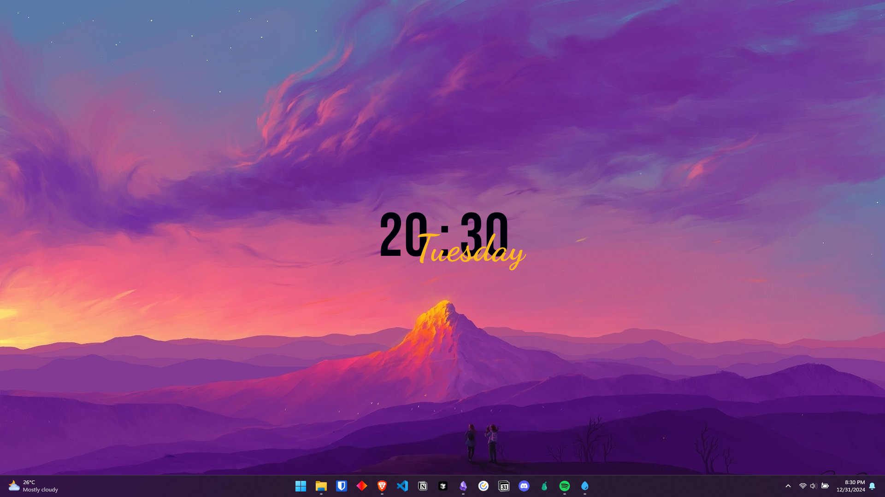
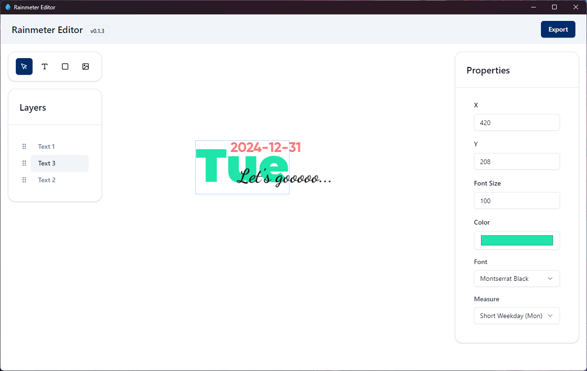

# Rainmeter Editor

Welcome to the Rainmeter Editor! This application allows you to create Rainmeter skins with ease.

## Repository Overview

Since Rainmeter Editor is not fully open-source, this repository serves as a place for:
- Bug reports
- Feature requests
- General discussions
- Instructions and tutorials

## Early Version Notice

This is still an early version of Rainmeter Editor, and more features will be added in the future. Stay tuned for updates!

## Download and Install

To get the latest version of Rainmeter Editor, please visit our [GitHub Releases](https://github.com/kethakav/rainmeter-editor-releases/releases) page and download the Windows setup file.

### Installation Instructions

1. Download the latest release from the [GitHub Releases](https://github.com/kethakav/rainmeter-editor-releases/releases) page.
2. Run the downloaded setup file.
3. **Important:** Windows SmartScreen may display a warning indicating that the app is from an unverified developer. To proceed with the installation:
   - Click on "More info".
   - Click on "Run anyway".

## Join Our Community

Join our community on [Discord](https://discord.gg/tzY82KkS4H) to get support, share your creations, and connect with other Rainmeter enthusiasts.

## Screenshots and Videos

#### YouTube Tutorial (Click on the image)
  
#### Screenshot

## Report Bugs and Request Features

If you encounter any bugs or have ideas for new features, please use the following templates to file your reports:
- [Report a Bug](https://github.com/kethakav/rainmeter-editor/issues/new?template=bug_report.yml)
- [Request a Feature](https://github.com/kethakav/rainmeter-editor/issues/new?template=feature_request.yml)

We appreciate your feedback and contributions!

---

We hope you enjoy using Rainmeter Editor!
