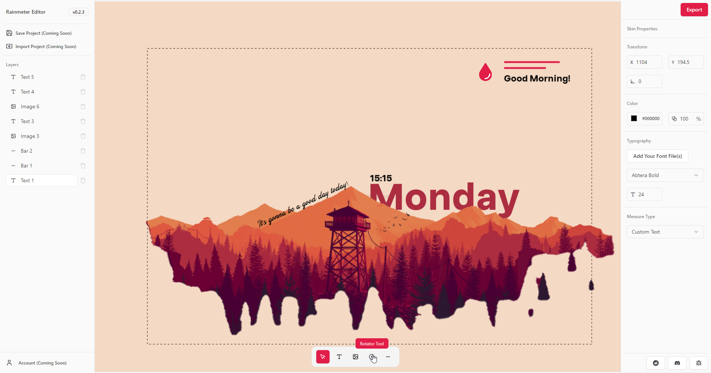

# Rainmeter Editor

> **Notice:** This project has moved! Rainmeter Editor is now fully open source. All development, releases, and discussions have moved to our new repository: [kethakav/rainmeter-editor](https://github.com/kethakav/rainmeter-editor)
>
> **Please visit the new repo for the latest downloads, source code, bug reports, and feature requests.**

---

Welcome to the Rainmeter Editor! This application allows you to create Rainmeter skins with ease.

## Repository Overview

This repository is no longer maintained. Please use the new repository for:
- Source code
- Bug reports
- Feature requests
- General discussions
- Instructions and tutorials

## Download and Install

To get the latest version of Rainmeter Editor, please visit our [new GitHub Releases page](https://github.com/kethakav/rainmeter-editor/releases) and download the Windows setup file.

### Installation Instructions

1. Download the latest release from the [new GitHub Releases page](https://github.com/kethakav/rainmeter-editor/releases).
2. Run the downloaded setup file.
3. **Important:** Windows SmartScreen may display a warning indicating that the app is from an unverified developer. To proceed with the installation:
   - Click on "More info".
   - Click on "Run anyway".

## Join Our Community

Join our community on [Discord](https://discord.gg/tzY82KkS4H) to get support, share your creations, and connect with other Rainmeter enthusiasts.

## Screenshots and Videos

#### YouTube Tutorial (Click on the image)
  
#### Screenshots

## Report Bugs and Request Features

If you encounter any bugs or have ideas for new features, please use the following templates in the new repository:
- [Report a Bug](https://github.com/kethakav/rainmeter-editor/issues/new?template=bug_report.yml)
- [Request a Feature](https://github.com/kethakav/rainmeter-editor/issues/new?template=feature_request.yml)

We appreciate your feedback and contributions!

---

We hope you enjoy using Rainmeter Editor!
